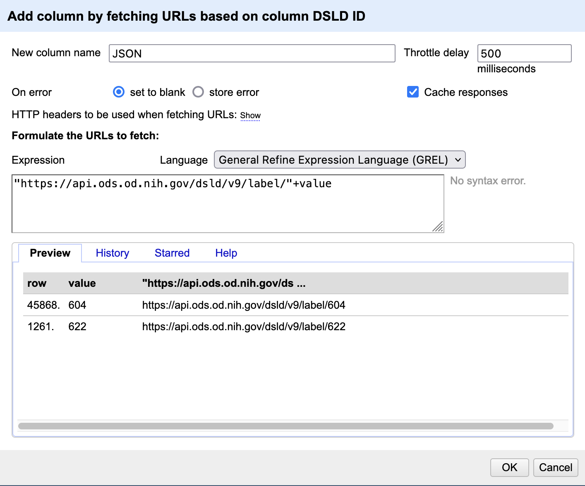

# Advanced OpenRefine

In addition to the basic data cleaning features, OpenRefine has a variety of advanced features. Here we will go over how to pull in data from external sources and add it to our spreadsheet. To learn more about other advanced features, check out the [Recommended Resources page](https://arieldeardorff.github.io/OpenRefineWorkshop/recommended-resources-and-tutorials.html).

## Pulling data from an API

Our current spreadsheet is missing some data about the tracking history of these products. Luckily, this data is available in the National Library of Medicine's Dietary Supplements Label Database and we can access it via an application programming interface (API). To learn more about this particular database and API you can visit [the website](https://datadiscovery.nlm.nih.gov/Drugs-and-Supplements/Dietary-Supplements-Label-Database-DSLD-Product-In/wp6t-qxsk). 

- Before we add a bunch of new data, let’s test our script on a couple of records. Go ahead and star five records using the little star icon on the far left of each record. 
    + Then, under `All` > `Facet` > `Facet by star` and select `TRUE` in the facet box on the left.
- Now we want to pull new data from the database using the `DSLD ID` number. Under the `DSLD ID` column select > `Edit column` > `Add column by fetching URLs`
    + In the box enter: `"https://datadiscovery.nlm.nih.gov/resource/wp6t-qxsk.json?dsld_id="+value` this is the URL of the API plus a stand-in for the ID number (the `+value`). You should see a preview of the URL with the ID at the end.
 
    
    
- Name the new column `JSON` and hit `OK`. It might take a minute or so to load but eventually we should get a paragraph of text in JSON format. 

## Extracting the Data

- JSON, or JavaScript Object Notation is a text format for storing and sharing data, often in lists or dictionaries. We basically asked the NLM database to send us all the info they have for this ID. Now we need to extract the info we want and put it in a new column
- Under the `JSON` column select `Edit column` > `Add column based on this column`
    + In the box write: `value.parseJson()[0]["tracking_history"]`. This is a GREL (google refine experssion language) command that tells OpenRefine to extract the relevant bit of the JSON data by pulling the first list of items [0] and then pulling the data that corresponds with the `Tracking history segment`. When you are done name this column `Tracking History` and hit `OK`. You can learn more about parsing JSON in this other library class: [Reading Data from an API with Python and JSON](https://courses.ucsf.edu/course/view.php?id=5247).
    

    
- There are a ton of ways to add more info to OpenRefine. In addition to adding new data you can also reconcile the data you have by pulling in official lists of names/businesses/authors from a site like Wikidata (more info in the resources section at the end).
- **Challenge**: add a new column containing the `database` info from the JSON. Hint: look at the `History` tab in your GREL workspace to see your previous commands.
