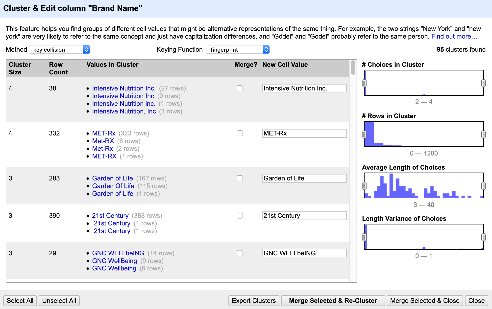

# Basic Data Cleaning with OpenRefine

Let's dive into our data with some basic exploration and cleaning.

## Splitting Columns

Sometimes you have more than one data point in a column and need to separate it out so you can analyze it separately (similar to the `Text to columns` operations in Excel)

- Let's split `Serving Size` into two columns – one for the amount and one for the unit
    + Using the drop-down menu select `Edit Column` > `Split into several Columns` - by separator (change to a blank space) > `split into 2 columns at most` > uncheck `remove this column`
- We now have two new columns – one called `Serving Size 1` and one called `Serving Size 2` let’s rename them `Serving Amount` and `Serving Unit` by clicking on `Edit column` > `Rename this column`
- **Challenge**: Use the `split` feature to divide the `Date Entered into DSLD column` into two columns, one for date and one for time. Can we conclude anything about the times?

## Undo/Redo

When we make a mistake in OpenRefine, we use `Undo/Redo` rather than a back button. 

- Let’s say we didn’t actually want to split `Date Entered into DSLD` into two columns. Click on `Undo/Redo` and select the action **before** the one we just did. Our split has now disappeared.

## Faceting Data

Faceting is one of the best parts of OpenRefine and can be used in a variety of ways including to get a snapshot of unique variables and to spot potential errors in your data.

Let's facet to get a snapshot of our data:

- We can scroll down to see if our splits have worked correctly but it is always smart to double check with a facet. Let’s get a snapshot of our new `Serving Unit` column by selecting `Facet` > `Text facet`
- On the left we can now see a list of all the different values in this column in alphabetical order or by count. There should be 433 choices. If we click on any of the options we will filter to just those rows. 
    + Some of the `Serving Units` look a little odd, but they were actually provided that way by the manufacturer so we will leave them for now.
- **Challenge**: What Brand makes a supplement that comes in the form of "Gummy Dolphin(s)"?
- **Challenge**: Use the `Facet` feature on the `Serving Amount` column. How many unique variables are there? What is the most frequent serving amount?

Now let's use faceting to find some potential mistakes:

- Now let’s try faceting the `LanguaL-Product Type` column. It looks like we have 14 choices but some of these look a little odd. For example, it looks like we have 25 records for `Amino acid/protein [A1305` and 2325 records for `Amino acid/protein [A1305]`. In this case we know that those 25 records should say `[A1305]`.To fix this, we can click `Edit` next to those records, update the records, and select `Apply`. No we have 13 choices
- It looks like there are a couple more spelling mistakes in this column, we could fix them manually as we did above, but let’s hold off and use the clustering feature later.
- **Challenge**: Facet the `Brands Names` column, how many options are there? Do you see any potential mistakes?
- **Challenge**: Explore the other kinds of facets, do any of these seem useful to you?

## Trimming Whitespace and Changing to Titlecase

- Some of the names in our `Brand Name` column look very similar. Before we spend a lot of time trying to manually clean or cluster all 1778 of them let’s try two easy cleaning steps.
- First, let’s change everything to titlecase by selecting `Edit cells` > `Common transforms` > `To titlecase` – now we have 1693 options.
- We might also want to trim any whitespace at the beginning or end of the row on the `Brand Name` column by selecting `Edit cells` > `Common transforms` > `Trim leading and trailing whitespace`. Note that on version 3.4 and above this will not make a difference as whitespace is automatically removed. 

## Clustering Data

Now let’s clean up the rest of our `Brand Name` column using Clustering! Clustering is one of the most powerful features in OpenRefine! Clustering is a tool for grouping names that are similar so that we can bulk edit them – it works on the syntactic level (spelling) not semantic (meaning)

- In the `Facet` window for our column, let’s hit `Cluster` in the upper right-hand corner
- OpenRefine uses two main algorithms for clustering the data:
    + `key collision`: generates a key from a value based on common transformations (what is the core value when you remove whitespace/capitalization/punctuation)
    + `nearest neighbor`: each unique value is compared to every other unique value using a distance function
- Fortunately, we don’t really need to understand the algorithms because it is easy to try them all!
    

    
- In the clustering box we can see:
    + `Cluster Size`: how many different options in that cluster
    + `Row Count`: how many rows will be changed
    + `Values in Cluster`: possible options
    + `Merge?`: check box if you wish to merge those cells
    + `New cell value`: what the cell should say
- Start with the `Key Collision` Method and work your way through the `Keying function` – there should be many options to cluster. If they all look good you can use `Select all` in the bottom left (note that you might need to decrease the size of your window to see this)
    + If the selected replacement looks correct we can check the `Merge` box and then click `Merge selected and re-cluster` at the bottom
    + As you work through the remaining algorithms you might see that some work better than others. Take a look at all the options but only cluster using the `Key Collision` – `fingerprint`, `ngram fingerprint` and `Nearest Neighbor` – `levenshtein` You should have approximately 1625 choices now (but don’t worry if you don’t have the same number) 
- **Challenge**: Which methods and keying functions **do not** seem like they will work for the Brand Name column?
- **Challenge**: `Facet` and `Cluster` the `LanguaL-Product Type` column. How many unique variables do you end up with?

## Sorting

- Right now the data is sorted by `Brand Name` first, what if we wanted to sort by `DSLD ID`?
- Under `DSLD ID` select `Sort` and we want to sort by `numbers`. Note that we can position errors and blanks at the beginning to help us spot them if we want. Hit `Ok` when you are happy with your sort.
    + You can edit your sort by selecting `Sort` again under the specific column. You can also select `Sort` > `Reverse` or `Remove sort` to undo (since it is not listed in the `Undo/redo` column).
    + Note that this didn't add any steps to the `Undo/Redo` - the sort is not permanent
    + If we wanted it to be permanent we would select `Sort` in the top middle > `Reorder rows permanently`
- We can sort by multiple things, just sort each row in the order you want them sorted (view the order in the sort menu) ex: sort `DSLD ID` then `Brand Name`

