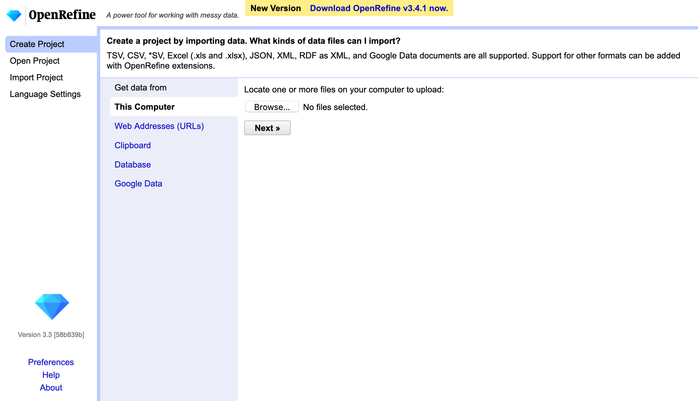
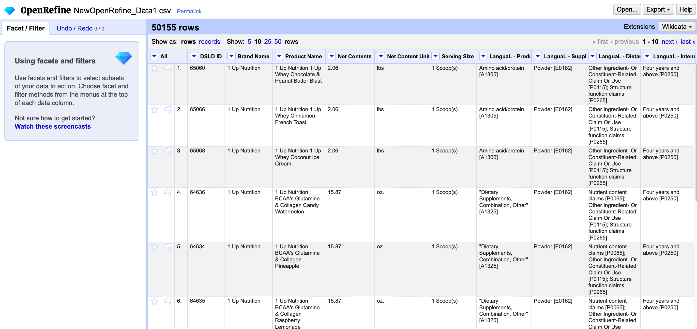

# Getting to Know our Data and Tools

Let's get to know our data and learn the basics of OpenRefine. 

## What is OpenRefine?

OpenRefine (formerly Google Refine) is an open-source tool for cleaning data. With OpenRefine you can:

- Identify and fix typos and errors in relatively large datasets (100,000 rows) fast
- Track all of your cleaning steps so you know exactly what changes you made
- Keep your raw data raw and export a cleaned version
- Re-run the same data cleaning steps on future datasets

An important thing to know about OpenRefine is that while it opens in your browser it is actually a java-based tool that is running on your computer, and therefore does not require internet access.

## Exploring the Data 

Now let's take a look at our data. Open the spreadsheet “NewOpenRefine_Data1.csv” in excel. 

Scenario: You want to learn more about different supplements over time so have downloaded a copy of the [National Library of Medicine Dietary Supplements Label Database](https://datadiscovery.nlm.nih.gov/Drugs-and-Supplements/Dietary-Supplements-Label-Database-DSLD-Product-In/wp6t-qxsk). Before you can start your analysis you want to check for missing/incorrect data. (Note that this copy of the data has been intentionally altered)

## Uploading Data Into OpenRefine

- Open OpenRefine (you might need to say `Allow` to run the first time or change security settings) – note that it opens in a browser at http://127.0.0.1:3333/
- On the main page we have three main tabs: 
    + `Create Project` – to create a new project from scratch – this is what we will be using today
    + `Open Project` - for an OpenRefine project you have previously worked on
    + `Import Project` – to import an OpenRefine project from someone else 
- Select `Create Project` and since we are uploading a file we will click `Get data from` > `This computer` > `Browse`
- Choose our file ("NewOpenRefine_Data1.csv") and hit `Next`
- The next screen is where we can preview our data to double check everything is being read in correctly 
- When everything looks good you select `Create Project` in the upper right corner 

## The OpenRefine Interface

- On the left of the OpenRefine workspace you will find two tabs: `Facet/Filter` and `Undo/Redo`
    + `Facet/Filter` is where we will see our different facets and filters appear as we click on them
    + `Undo/Redo` is how we undo changes – note that OpenRefine does not have a “back” button.
- In the middle you will find your data – note that you can select how many rows you want to see at once – from 5 to 50.
- If you have a large dataset or don’t want to see all your columns at once you can re-arrange or hide your columns
    + To re-arrange/hide all columns you can go to the first column `All`, click the drop down menu, select `Edit columns` > `Re-order/remove columns`. Then you can re-order them or remove ones you don’t need
    + Alternatively, you can click on a specific column and then choose `View` > `Collapse all the right/left`
      - To undo this action you need to click `All` > `Expand all columns`
